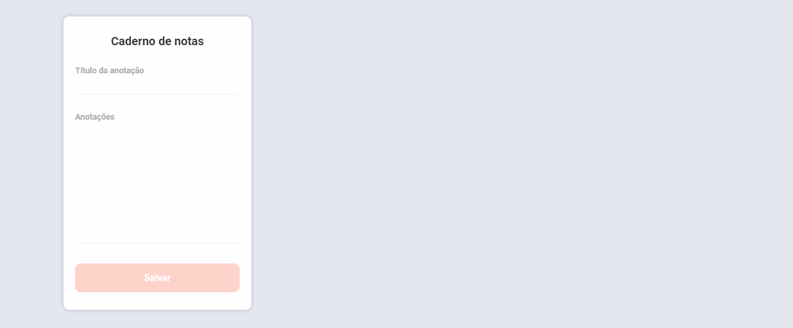

<h1>DayNotes</h1>

Habit creation project to help you in everyday life.

### How to run the project:

**You can clone the project and run it locally following the steps below**

1. `git clone https://github.com/Caique017/DayNotes.git` to clone the project
2. `npm install` to install project dependencies
3. to run the frontend, go to vscode's built-in terminal and run `npm start`, it will take you to a page where to render the backend you have to open a separate terminal in CMD enter the backend folder and run `npm run dev`.
 
 
Project developed with the intention of helping people who need an incentive or something to write down what they need to do in a certain time or with a certain priority, with our functionality you can choose whether you prefer to develop something with a priority or not. 

The following technologies were used: React, axios, cors, express, mongoose and other technologies. 

  

 any questions send me a message via linkedin: <a href="https://www.linkedin.com/in/caique-nunes-624720202/" target="_blank">My profile</a> 

